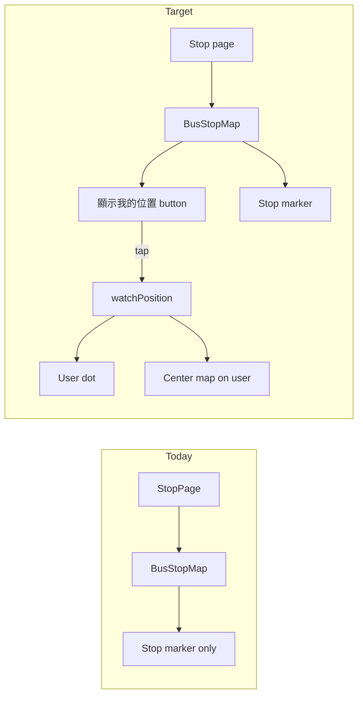

# User location on stop-detail map

## Grilling summary (decisions locked in)

| Decision | Your choice |
|----------|-------------|
| Scope | Stop detail page only |
| Primary outcome | Glanceable direction (not distance or turn-by-turn) |
| Permission denied | Stop-only map + message/button to retry |
| Location updates | Continuous (`watchPosition`) after opt-in |
| Map camera | Centered on user; stop marker drifts toward edge |
| Permission timing | Only after user taps "show my location" |
| Visual cue | Two markers only (simplest; you were unsure) |
| Validation | Manual test on phone outdoors |

## Current state

- [`src/lib/components/BusStopMap.svelte`](src/lib/components/BusStopMap.svelte) already renders a Leaflet map with one marker at the stop's `lat`/`long`.
- [`src/routes/[companyId]/route/[route]/stop/[stopId]/+page.svelte`](src/routes/[companyId]/route/[route]/stop/[stopId]/+page.svelte) shows it under **站點位置** when coords are non-zero.
- Leaflet is installed; CSS is imported in [`src/routes/app.css`](src/routes/app.css).
- No geolocation code exists yet.

## Implementation approach

**Single-file change in [`BusStopMap.svelte`](src/lib/components/BusStopMap.svelte)** — no new dependencies, no stop-page changes unless wiring a prop later.

### 1. Location state machine

Add internal state:

- `idle` — stop-only map (current behavior); show **顯示我的位置** button below map
- `tracking` — `watchPosition` active; user marker visible; map centers on user
- `denied` / `unavailable` — stop-only map + inline message (e.g. **無法取得位置，請檢查瀏覽器權限**) + retry button

On component destroy / `$effect` cleanup: call `navigator.geolocation.clearWatch()`.

### 2. Markers and camera

- **Stop**: keep existing `L.marker` with popup label (unchanged).
- **User**: `L.circleMarker` (blue dot, ~8px radius) — visually distinct, no extra image assets.
- **Initial view** (before tracking): `setView([stopLat, stopLng], 17)` — unchanged.
- **After tracking starts**: `map.setView([userLat, userLng], currentZoom)` on each position update; do **not** auto-fit bounds (per your choice — map stays user-centered).

Store map instance in a variable accessible to the watch callback so position updates can move the user marker and recenter without reinitializing the map.

### 3. Opt-in button UX

Below the map (Traditional Chinese, matching app copy):

- Idle: **顯示我的位置** — starts `watchPosition`
- Tracking: **停止定位** — clears watch, removes user marker, recenters on stop
- Denied: **重試定位** — retries `watchPosition`

Use existing `vesuvius-*` / `Button` component if it fits; otherwise match stop-page link styles.

### 4. Error handling

Map `watchPosition` errors:

| Code | UI |
|------|-----|
| `PERMISSION_DENIED` | denied state + retry |
| `POSITION_UNAVAILABLE` | unavailable message + retry |
| `TIMEOUT` | retry (GPS slow indoors) |

If geolocation is unsupported (`!navigator.geolocation`), hide the button and keep stop-only map.

### 5. Accessibility

- Button: clear `aria-label` (e.g. **顯示目前位置於地圖上**)
- Map `aria-label` updated when tracking: **巴士站與你的位置地圖**
- Keep **位置僅供參考** disclaimer

## Files touched

| File | Change |
|------|--------|
| [`src/lib/components/BusStopMap.svelte`](src/lib/components/BusStopMap.svelte) | Geolocation opt-in, user marker, camera logic, error/retry UI |
| Stop page | **No change** — existing `<BusStopMap lat lng label />` usage stays |

## Out of scope (confirmed by grilling)

- Route list / favorites maps
- Distance label, walking route polyline, or external navigation deep-link as primary UX
- Server-side location or background tracking

## Validation (your plan)

1. On phone (HTTPS or localhost): open a stop with valid coords (e.g. CTB route).
2. Tap **顯示我的位置** → grant permission → blue dot appears, map centers on you, stop marker offset shows direction.
3. Walk a few meters → dot and center update.
4. Deny permission → stop-only map + retry message.
5. Tap **停止定位** → user dot removed, map recenters on stop.

## Risks to watch

- **GPS accuracy indoors** — dot may jump; disclaimer already says 位置僅供參考.
- **Battery** — continuous watch is intentional; mitigated by explicit opt-in and stop button.
- **iOS Safari** — requires secure context (Netlify deploy is fine); permission prompt only fires on button tap (good for Safari policy).
- **Small map** (`h-48` / 192px) — direction glance may be tight; acceptable unless you want taller map later.

## Open questions (non-blocking)

- Map height: keep `h-48` or bump to `h-56`/`h-64` for easier direction reading? Default: keep as-is (minimal diff).
- Should tracking auto-stop when user leaves the page? Default: yes, via effect cleanup.
